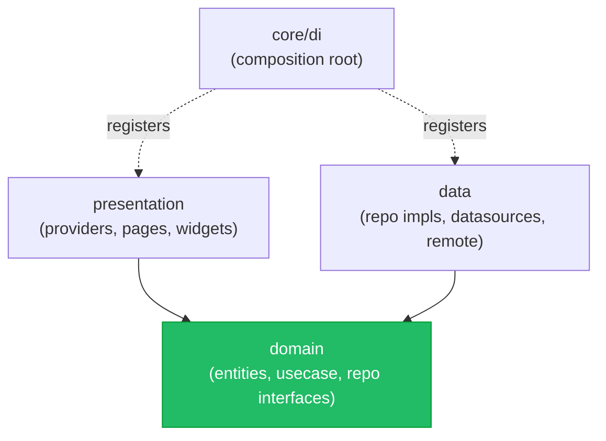
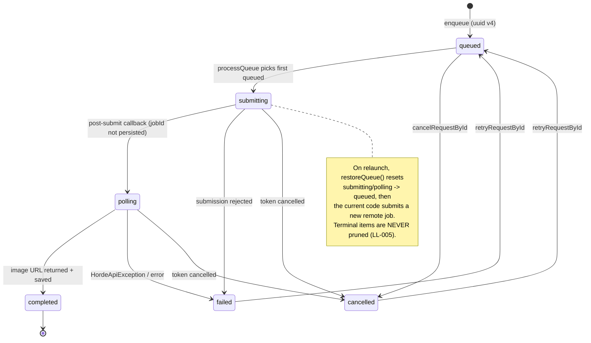

# ARCHITECTURE

> System reference for **LineLeap** — how the app is built: layers, the generation-queue pipeline, the data model, state, DI, and navigation. Read this to understand *why* the code is shaped the way it is before changing it.

**Last updated: 2026-07-29**

**How to use this doc:** This is a *reference*, not a task list. Skim the [Overview](#1-overview) and [Layers](#2-layers--the-dependency-rule) to orient, then jump to the subsystem you're touching. Every constraint here is cross-linked to a canonical issue in [BACKLOG.md](./BACKLOG.md); the [Known architectural constraints](#9-known-architectural-constraints) table and [What NOT to change](#10-what-not-to-change) are the guardrails — read both before editing. To set up and run the app, see [DEVELOPMENT.md](./DEVELOPMENT.md). To execute a change safely, see [RUNBOOK.md](./RUNBOOK.md). The queue subsystem has a deep-dive companion in [AI_QUEUE_CASE_STUDY.md](./AI_QUEUE_CASE_STUDY.md). Doc index: [README.md](./README.md).

---

## 1. Overview

LineLeap is a **local-first Flutter sketch-to-image app**. The user draws on a canvas, types a prompt, and the drawing is submitted as an **img2img** job to the **Stable Horde** public anonymous API. Completed images are downloaded and, on explicit user action, promoted into a local **Hive** gallery.

| Fact | Value |
|---|---|
| pubspec name | `lineleap` (version `1.0.1+14`) |
| Backend | **None.** Only the public Stable Horde API (`https://stablehorde.net`) |
| Auth / accounts | **None.** Anonymous Horde key `0000000000` by default |
| Persistence | **Local only** — Hive (2 boxes) + SharedPreferences (theme) + device files |
| State mgmt | `provider` (ChangeNotifier) |
| DI | `get_it` (`sl`, single instance) |
| Networking | `http` |

**Bootstrap sequence** (`lib/main.dart:16-61`): `WidgetsFlutterBinding.ensureInitialized` → install global `FlutterError.onError` (`lib/main.dart:20`) → `Hive.initFlutter` → register `ScribbleTransformationHiveAdapter` (typeId 0) (`lib/main.dart:29`) → `initDependencies()` (`lib/core/di/injection_container.dart:39`) → `runApp` a `MultiProvider` of 6 `ChangeNotifier`s (`lib/main.dart:38-52`) → `MaterialApp` with `home: NavBar`. The whole body is wrapped in `try/catch`; any init failure renders an `ErrorApp` fallback (`lib/main.dart:56-60`).

---

## 2. Layers & the dependency rule

Clean-architecture-style layering. The intended dependency direction is **inward**: presentation → domain ← data (both presentation and data depend on domain abstractions; domain depends on neither).

```
lib/
├── core/          cross-cutting: di/ (composition root), config/, service/, utils/
├── data/          remote APIs, datasources (local Hive + in-memory), repository impls, Hive models
├── domain/        entities, repository INTERFACES, usecases, service interfaces  (the seam)
└── presentation/  providers (ChangeNotifier), features/ (pages+widgets), common/ widgets
```



**The rule holds for the queue seam** (usecases depend only on `GenerationQueueRepository` / `HordeGenerationService` interfaces) — preserve that. But note these **known, deliberate-for-now violations** (do not "fix" them casually; they are tracked):

| Violation | Where | Note |
|---|---|---|
| Domain imports Flutter | `lib/domain/repositories/theme_mode_repository.dart:1` (`ThemeMode`); `lib/domain/entities/drawing_state.dart:1` (`dart:ui` `Color`); `lib/domain/entities/stroke.dart` (`Color`/`Offset`) | Entities leak framework types across the seam. |
| Composition root imports presentation | `lib/core/di/injection_container.dart:31-35` | `core/` depends on `presentation/`; the DI file is really the app root, not "core". |
| DI hard-casts a repo interface to its impl | `lib/core/di/injection_container.dart:144-145` | `restoreQueue()` lives only on the impl, so DI does `as GenerationQueueRepositoryImpl`. |

---

## 3. Generation queue pipeline

The current implementation is an **event-driven, single-flight queue with persisted records**. Persistence does not yet mean remote-job resumption: interrupted active records are re-queued and submitted again. Deep dive: [AI_QUEUE_CASE_STUDY.md](./AI_QUEUE_CASE_STUDY.md).

### 3.1 Numbered step sequence

1. **Capture.** `GenerationProvider.sequenceForGenerationRequest` rasterizes the canvas via `ImageUtils.capturePng` → `RenderRepaintBoundary.toImage(pixelRatio: 3.0)`, then composites the result over an opaque white background before encoding PNG bytes. The on-screen canvas remains theme-aware; LL-002 manual verification is still pending.
2. **Persist scribble file.** Bytes are written to the app documents dir as a PNG (`generation_provider.dart:139` → `SaveImagebytesReturnPathUseCase` → `ImageDeviceInteractionService.saveImageToDevice`, `lib/core/service/image_device_interaction_service.dart:6-15`). The **absolute** path is what gets stored (LL-007).
3. **Enqueue.** `EnqueueGenerationRequestUseCase` mints a **uuid v4** `localId` (`lib/domain/usecases/enqueue_generation_request_usecase.dart:16`) and calls `GenerationQueueRepositoryImpl.enqueueRequest`, which writes to **both** the in-memory `GenerationQueueNotifier` **and** the Hive `generation_queue` box (`lib/data/repositories/generation_queue_repo_impl.dart:31-34`). Status starts `queued`.
4. **Bridge to a stream.** `observeQueuedRequests()` wraps the `ChangeNotifier` in a broadcast `Stream<List<GenerationRequest>>` (`generation_queue_repo_impl.dart:65-82`).
5. **Process (event-driven, single-flight).** `ProcessGenerationQueueUseCase.startListening()` (`lib/domain/usecases/process_generation_queue_usecase.dart:23-34`, wired at DI `injection_container.dart:147`) listens and calls `processQueue()` on every change. `processQueue()` guards re-entry with `_isProcessing` (`process_generation_queue_usecase.dart:38`), picks the **first** `queued` item (`:50-53`), and drives the state machine: `submitting` (`:60-64`) → `polling` (set by a service callback immediately after submit, before the first status request; `horde_generation_service_impl.dart:37-51`) → `completed` (`:87-92`) / `cancelled` (`:93-103`) / `failed` (`:104-110`). The async progress callback is not awaited by the service, so it is a notification rather than a transactional boundary. The use case persists the terminal state (`:113`) then calls `_checkForMore()` (`:119`, `:124-132`) to pick up the next item.
6. **Horde submit / poll / download / save.** `HordeGenerationServiceImpl.generateFromPrompt` (`lib/data/services/horde_generation_service_impl.dart:21-78`) currently combines the whole remote lifecycle: read and base64-encode the scribble, `submitSketchJob` → `pollForResult` → `downloadImage`, then save the result via `ImageDeviceInteractionService.saveImageToDevice`, **filename = Horde jobId** (`horde_generation_service_impl.dart:66-67`). The returned job ID never crosses the service boundary, so it is not persisted on `GenerationRequest`; LL-004 must split submit from poll/resume (or expose a durable post-submit callback) and persist the ID before polling.
7. **Promote metadata to gallery (user-gated).** A completed item is **not** in the gallery yet. When the user taps **download** in the queue overlay, `GalleryNotifier.saveToHistory` writes gallery metadata containing the queue item's existing file paths; after a successful save, the overlay removes the queue record (`lib/presentation/features/scribble/queue_overlay_widget.dart:62-78`). It does **not** copy or transfer the files. Queue cleanup must therefore distinguish promoted/shared files from queue-owned temporary files (LL-005), or it can delete images still referenced by the gallery.

> **Cancellation** is threaded end-to-end via `GenerationCancellationToken` (`lib/domain/entities/generation_cancellation_token.dart`), checked before/after every network send and during backoff in 250 ms slices (`lib/data/remote/ai_horde_api.dart:349-361`). Keep this threading intact.

### 3.2 Sequence diagram

```mermaid
sequenceDiagram
    actor User
    participant UI as QueueOverlay
    participant GP as GenerationProvider
    participant EQ as EnqueueUseCase
    participant Repo as QueueRepositoryImpl
    participant Note as QueueNotifier (mem)
    participant DS as QueueLocalDatasource (Hive)
    participant Files as ImageDeviceInteractionService
    participant PU as ProcessQueueUseCase
    participant Svc as HordeGenerationService
    participant API as AIHordeAPI
    participant Horde as Stable Horde
    participant Gal as GalleryNotifier (Hive)

    User->>GP: draw + prompt
    GP->>GP: capture canvas (RepaintBoundary.toImage px3.0)
    GP->>Files: save scribble PNG (absolute path)
    GP->>EQ: enqueue(prompt, scribblePath)
    EQ->>Repo: enqueueRequest(uuid v4, status=queued)
    Repo->>Note: addRequest()  (in-memory)
    Repo->>DS: saveRequest()   (persist)
    Note-->>PU: observeQueuedRequests() stream fires
    PU->>PU: processQueue() single-flight (_isProcessing)
    PU->>Repo: update status=submitting
    PU->>Svc: generateFromPrompt(token)
    Svc->>API: submitSketchJob(base64, prompt)
    API->>Horde: POST /api/v2/generate/async  (expect 202)
    Horde-->>API: { id: jobId }
    API-->>Svc: jobId
    Svc-->>PU: onProgress(1) -> status=polling
    Note over PU,Svc: callback fires post-submit, before first status poll
    loop poll (20 attempts; ~5m50 scheduled delay, plus request time)
        API->>Horde: GET /api/v2/generate/status/{jobId}
        Horde-->>API: { done, generations[].img }
        API-->>Svc: HordeGenerationProgress
        Svc-->>PU: onProgress(percent only)
    end
    API->>Horde: GET image URL (download)
    Svc->>Files: save result PNG (filename = jobId)
    PU->>Repo: update status=completed (generatedPath)
    User->>UI: tap Download
    UI->>Gal: saveToHistory(existing file paths)
    Gal-->>UI: metadata saved
    UI->>Repo: remove queue record; files remain shared
```

### 3.3 Status state machine

`GenerationStatus` (`lib/domain/entities/generation_request.dart:1-8`). Reordering these enum values corrupts persisted data (see [§4](#4-data-model--hive-boxes)).



### 3.4 AIHordeAPI contract (`lib/data/remote/ai_horde_api.dart`)

| Aspect | Value / location |
|---|---|
| Base URI | `https://stablehorde.net` (`:147`) |
| Submit | `POST /api/v2/generate/async`, expects **202** (`:175`, `:186`) |
| Poll | `GET /api/v2/generate/status/{id}` (`:223`) |
| Params | `k_euler_a`, cfg `7.5`, denoise `0.75`, `512x512`, `20` steps, `n=1` (`HordeGenerationParams`, `:45-75`) |
| Payload flags | `nsfw: false`, `source_processing: img2img`, `trusted_workers: false` (`:164-171`) |
| Polling policy | `20` attempts, `5s` initial, `20s` max, `1.35` factor → about **5m50 of scheduled delay** (`HordePollingPolicy`, `:77-99`). This is not a wall-clock ceiling: response latency and the `30s` per-request timeout add to it. The fixed attempt budget is the root of LL-004. |
| Per-request timeout | `30s` (`:144`) |
| Retryable classification | HTTP `429` or `>= 500` (`:407`) |
| Cancellation | checked in `_send` before/after (`:322-324`) and in `_delay` 250 ms slices (`:349-361`) |
| Error type | typed `HordeApiException` + `HordeApiFailureKind` (`:14-43`); defensive JSON parsing, no unchecked casts on server fields (`:363-395`, `:411-429`) |
| Progress | `queue_position` / `wait_time` are parsed into `HordeGenerationProgress` (`:100-128`, `:363-375`), but `HordeGenerationServiceImpl` reduces the callback to an integer percent and the use case does not retain that value. Position/ETA never reach presentation (LL-021). |

---

## 4. Data model & Hive boxes

Two Hive boxes, **two different serialization strategies**, **no schema versioning, no migrations anywhere.**

| Box | Type | Serialization | Opened |
|---|---|---|---|
| `gallery_history` | `Box<ScribbleTransformationHive>` | Generated typed adapter, **typeId 0** (`lib/data/models/scribble_transformation_hive_model.dart:6`) | eager in DI (`injection_container.dart:41-43`) |
| `generation_queue` | **raw `Box<Map>`** | Hand-rolled `_toMap` / `_fromMap` codec (`lib/data/datasources/local/generation_queue_local_datasource.dart:35-63`) | lazily on first access (`:8-11`) |

**Registered adapters:** only `ScribbleTransformationHiveAdapter` (typeId 0), registered in `main.dart:29`.

### Footguns (each is load-bearing)

- **`status` stored as `enum.index`** (`generation_queue_local_datasource.dart:41`, read back via `GenerationStatus.values[...]` `:53`). **Reordering or inserting values in `GenerationStatus` silently corrupts every persisted queue record.** Only ever append new enum values at the end.
- **Persisted and transient timestamps are conflated.** `gallery_history.createdAtHive` is a `String` (`scribble_transformation_hive_model.dart:18`), and gallery promotion persists epoch-millis (`queue_overlay_widget.dart:68-70`). The queue's *view-only* object instead receives ISO-8601 or `"-"` (`:92-95`); that value is not written to Hive and the dialog tries to parse it as epoch-millis. `GenerationRequest.createdAt` is never set at enqueue. During a session the gallery inserts new items at index 0, while a cold load uses unsorted Hive iteration order, so ordering can change after restart (LL-010).
- **`DateTimeAdapter` (typeId 16) exists but is never registered or used** (`lib/data/models/date_time_adapter.dart:6`; file comment says it's "on hold"). Dead config; do not assume DateTimes round-trip as ints anywhere.
- **`restoreQueue()` re-queues interrupted records but does not resume them.** On launch it resets `submitting`/`polling` → `queued` (`generation_queue_repo_impl.dart:18-27`). Because `generationId` is not persisted by the current service flow, processing submits a new Horde job. Terminal `completed`/`failed`/`cancelled` records are restored indefinitely and never pruned (LL-004/LL-005).
- **Stored paths are absolute** app-container paths (`image_device_interaction_service.dart:10-14`). Container base paths are not durable identifiers. LL-007 needs one centralized resolver used by every file consumer plus an idempotent migration from legacy absolute records to relative storage identifiers; changing only the save service is insufficient because presentation and the Horde service construct `File(path)` directly.
- **Theme is *not* in Hive.** It uses `SharedPreferences` (`lib/data/repositories/theme_mode_repository._impl.dart:9-12`). *(Note the typo filename `theme_mode_repository._impl.dart` — LL-014.)*

---

## 5. State management (provider / ChangeNotifier)

Six `ChangeNotifier`s appear in the root `MultiProvider` (`main.dart:38-52`). Five presentation providers are registered in DI as factories; `GenerationQueueNotifier` is an eager singleton shared with the repository. Provider `create` callbacks are lazy by default, so do not rely on all six being instantiated at the same bootstrap instant.

| Provider | Holds | Notes |
|---|---|---|
| `EnhancedScribbleNotifier` | `DrawingState` (strokes, color, brush, **history + historyIndex**, mirror mode) | `lib/presentation/common/providers/scribble_notifier.dart:9-27`. Undo/redo history is the source of LL-001; canvas perf is LL-012. |
| `GenerationProvider` | capture/enqueue orchestration; `_currentGenerationId`; actionable `_error` | `ScribblePage` watches capture/enqueue error state and renders the shared retryable message card. **The `_startWatchingRequest` subsystem is still effectively dead** — the page enqueues directly and terminal state comes from the queue stream instead. |
| `GalleryNotifier` | gallery list; loading state; separate load/operation errors | `GalleryPage` owns the single initial load and displays a durable retry card. Save/delete callers display retryable feedback; delete updates the in-memory list only after the repository call succeeds. Tombstone-based recovery for partial persistence/file failures remains LL-011. |
| `QueueStatusProvider` | mirror of the queue via `observe()` stream | This is what the queue UI actually reads. Failed records expose their persisted reason; retry persistence failures are returned to the overlay for visible feedback. |
| `ThemeNotifier` | current `ThemeMode` (**write-only** persistence) | `theme_notifier.dart:6` hardcodes `ThemeMode.system` at startup; the saved value is never restored (LL-006). |
| `GenerationQueueNotifier` | the **in-memory** queue list (source of truth for the queue stream) | `lib/data/datasources/in_memory/generation_queue_notifier.dart`. It's in the `MultiProvider` (`main.dart:48-50`) but has **zero UI consumers** — it's consumed internally by the repository, not the widget tree. |

**Queue state is duplicated by design.** The queue lives in **two** places: the in-memory `GenerationQueueNotifier` (drives the reactive stream / UI) and the Hive `generation_queue` box (survives restart). Enqueue, update, and remove attempt a dual write, but there is no transaction across memory and Hive; a failed second write can still leave them divergent. New write paths must update both, and concurrency-sensitive transitions should add serialization or compare-and-set semantics rather than rely on a read followed by an unconditional write (LL-009).

---

## 6. Dependency injection (`get_it`)

Single container `sl` (`injection_container.dart:37`); `initDependencies()` runs once at bootstrap.

| Registration kind | Members |
|---|---|
| **Eager singletons** (`registerSingleton`) | `Box<ScribbleTransformationHive>` (opened `await`), `AIHordeAPI`, `GenerationQueueNotifier`, `GenerationQueueLocalDatasource` (`:41-48`), `ThemeModeRepository` (`:62`) |
| **Lazy singletons** (`registerLazySingleton`) | all services (`:51-59`), all other repositories (`:63-81`), all usecases (`:84-120`) |
| **Factories** (`registerFactory`) | 5 presentation providers (`:122-141`); `GenerationQueueNotifier` is the eager singleton above |
| **Post-registration side effects** | hard-cast `queueRepo as GenerationQueueRepositoryImpl` → `restoreQueue()` (`:144-146`), then `ProcessGenerationQueueUseCase.startListening()` (`:147`) |

> **Dead DI chains** (registered but unreachable, LL-014): `ImageGenerationRepository`→`ImageGenerationRepositoryImpl` (`:79-81`) feeding `GenerateTransformationfromscribbleUseCase` (`:115-117`), and `DeleteImagebytesFromPathUseCase` (`:97-99`). These are leftovers from the abandoned Replicate/Vertex path.

---

## 7. Navigation

- `MaterialApp` `home: NavBar` (`main.dart:72`). No router, no named routes, no deep-linking.
- `NavBar` uses an **`IndexedStack`** of `[ScribblePage, GalleryPage]` (`lib/presentation/features/nav_bar.dart:19`, `:73`). **State is preserved** across tab switches, and both pages initialize at launch. `GalleryPage` performs one post-frame History load; `GalleryNotifier` no longer starts a duplicate constructor load.
- All secondary navigation is **imperative** — `showDialog` / bottom sheets (e.g. the queue overlay, gallery image dialog, model selector sheet). There is no declarative navigation stack.

---

## 8. AI provider surface (what's actually wired)

- **Only Stable Horde is live.** `lib/data/remote/replicate_api.dart` and `lib/data/remote/google_vertex_ai_api.dart` are **100% commented-out dead files** (LL-014).
- **API key:** `AI_HORDE_API_KEY` via `String.fromEnvironment`, default `'0000000000'` (the Horde public anonymous key) — `ai_horde_api.dart:9-12`. Override at run/build with `--dart-define=AI_HORDE_API_KEY=<key>` (see [DEVELOPMENT.md](./DEVELOPMENT.md)).
- **The model selector is fake and scheduled for removal** — it offers DALL-E 3 / Midjourney / Leonardo, none of which Horde serves, and the choice is never sent. LL-017 removes the control; real Horde model selection would be separately scoped.

---

## 9. Known architectural constraints

Structural issues baked into the current design. Full detail, evidence, and acceptance criteria live in [BACKLOG.md](./BACKLOG.md); execution recipes live in [RUNBOOK.md](./RUNBOOK.md), and live status lives only in [PROGRESS.md](./PROGRESS.md).

| ID | Title | P / M | Architectural constraint (the "why it's structural") |
|---|---|---|---|
| [LL-004](./BACKLOG.md) | Long Horde queues fail; persist generationId, resume polling, remote cancel, adaptive polling | P1 / M2 | Submission and polling are currently one service call, so `generationId` never reaches the persisted request. Split submit from poll/resume (or expose a durable post-submit seam), persist the ID before polling, resume only when an ID is present and valid, and make a new submission an explicit fallback. Remote cancel uses that persisted ID. Adaptive polling needs a wall-clock policy informed by `wait_time`/`queue_position`, not another fixed attempt count. |
| [LL-005](./BACKLOG.md) | Bound queue history and define image-file ownership | P1 / M2 | `restoreQueue()` restores terminal items forever (`generation_queue_repo_impl.dart:15-28`), but indiscriminate file deletion is unsafe: gallery promotion stores the same paths and then removes the queue record. Define queue-owned versus gallery-owned/shared files, transfer ownership on promotion (or copy/reference-count), retain retry inputs as required, and only then add bounded pruning and reconciliation. |
| [LL-006](./BACKLOG.md) | Saved theme is never restored on launch | P1 / M1 | Write-only persistence: `ThemeNotifier` hardcodes `ThemeMode.system` (`theme_notifier.dart:6`); `getThemeMode()` has zero callers (`theme_mode_repository._impl.dart:14-20`). |
| [LL-007](./BACKLOG.md) | Absolute file paths break the iOS gallery after app update | P1 / M2 | Absolute container paths are persisted (`image_device_interaction_service.dart:10-14`) and used directly throughout data and presentation. Introduce one storage-path abstraction/resolver, persist relative identifiers, and run an idempotent migration for both Hive stores before removing legacy support. |
| [LL-009](./BACKLOG.md) | Make queue state transitions atomic and cancellation-safe | P2 / M3 | `processQueue` persists a captured local var at the end (`process_generation_queue_usecase.dart:60-113`) while `cancelRequestById` (`:153-172`) writes independently. A final re-read alone is still subject to a race; terminal transitions need serialization or an atomic compare-and-set/version check so cancellation cannot be overwritten. |
| [LL-010](./BACKLOG.md) | Add stable gallery IDs, normalized UTC timestamps, and deterministic sorting | P2 / M3 | Persisted gallery timestamps are epoch strings, the queue-view timestamp is transient ISO/`"-"`, and `createdAt` is null at enqueue. Choose one domain timestamp contract, set it at enqueue, migrate existing rows (including invalid/missing values), add/backfill a stable gallery ID, and sort explicitly rather than relying on Hive iteration order. |
| [LL-012](./BACKLOG.md) | Rework canvas performance model | P2 / M3 | O(n²) list copies per pointer sample (`scribble_notifier.dart:196-209`), full repaint + `shouldRepaint` always true (`scribble_painter.dart:64-121`), toolbar rebuild storm (`pinned_toolbar_overlay.dart:32`). |
| [LL-013](./BACKLOG.md) | Unify error handling into one typed-failure flow | P2 / M3 | Return-null, user-message, rethrow, and typed-exception conventions still coexist; `HordeApiException.kind/statusCode/isRetryable` is flattened to `error.toString()` when a queue record fails. LL-003 exposes that text but does not yet preserve typed retryability end to end. |
| [LL-021](./BACKLOG.md) | Show queue position/ETA and best-effort completion notifications | P1 / M2 | Progress is discarded at the service boundary. Move a provider-neutral progress value through service → use case → queue state/UI. A local notification can be guaranteed only while the process is executing; reliable completion after OS suspension/termination requires a background-execution design or remote push, not only a notification plugin. |

Related but not purely architectural (see BACKLOG): **LL-001** (undo/redo corruption), **LL-002** (transparent capture background), **LL-003** (hidden error details/offline guidance), **LL-011** (recoverable gallery deletion), **LL-014** (dead code/deps), **LL-015** (lifecycle leaks), and **LL-017** (remove the fake model selector).

---

## 10. What NOT to change

These are useful existing properties and migration traps. Preserve the first group unless an issue explicitly replaces its contract; plan migrations for the second.

**Preserve these properties:**
- ☐ **`AIHordeAPI` design** — typed exceptions, retryable classification, backoff policy, defensive JSON parsing. Extend it (LL-004/LL-021), don't rewrite it.
- ☐ **`GenerationCancellationToken` threading** end-to-end (`generation_cancellation_token.dart` through API `_send`/`_delay`). Keep every check site.
- ☐ **The domain/data seam for the queue** — usecases depend on the repository/service *interfaces*. Keep new logic behind the interfaces.
- ☐ **Single-flight processing** (`_isProcessing` guard, `process_generation_queue_usecase.dart:38`) and consistent updates to memory + Hive (`generation_queue_repo_impl.dart:31-34`). LL-009 may strengthen this with serialized/conditional transitions; do not add another uncoordinated write path.
- ☐ **`IndexedStack` tabs** (`nav_bar.dart:73`) — tab state preservation is intentional.
- ☐ **`RepaintBoundary` capture strategy** (`image_utils.dart:13`) — keep it; only fix the *background* (LL-002), don't replace the capture mechanism.

**Do not touch without a migration plan (silent-corruption traps):**
- ☐ **`GenerationStatus` enum order** (`generation_request.dart:1-8`) — persisted as `enum.index`. Only append new values at the end; never reorder/insert. There are **no migrations** to save you.
- ☐ **Hive typeId 0** (`ScribbleTransformationHive`) and its field numbers — changing them orphans the existing `gallery_history` box.
- ☐ **The two-store queue duplication** — memory (`GenerationQueueNotifier`) and disk (`generation_queue` box) must be changed together. For concurrency-sensitive writes, use the serialized/CAS contract introduced by LL-009 rather than a read followed by an unconditional `updateRequest`.

**Repo/tooling gotchas (also in [RUNBOOK.md](./RUNBOOK.md)):**
- ☐ **`.gitignore` contains a bare `INDEX.md`**, which ignores *any* file named `INDEX.md` at any depth. The docs index **must** be `docs/README.md`, never `docs/INDEX.md`.
- ☐ **Never commit** `android/key.properties` or `android/upload-keystore.jks` (git-ignored; release-signing only).

---

*Sibling docs: [README.md](./README.md) · [DEVELOPMENT.md](./DEVELOPMENT.md) · [BACKLOG.md](./BACKLOG.md) · [PROGRESS.md](./PROGRESS.md) · [RUNBOOK.md](./RUNBOOK.md) · [AI_QUEUE_CASE_STUDY.md](./AI_QUEUE_CASE_STUDY.md)*
